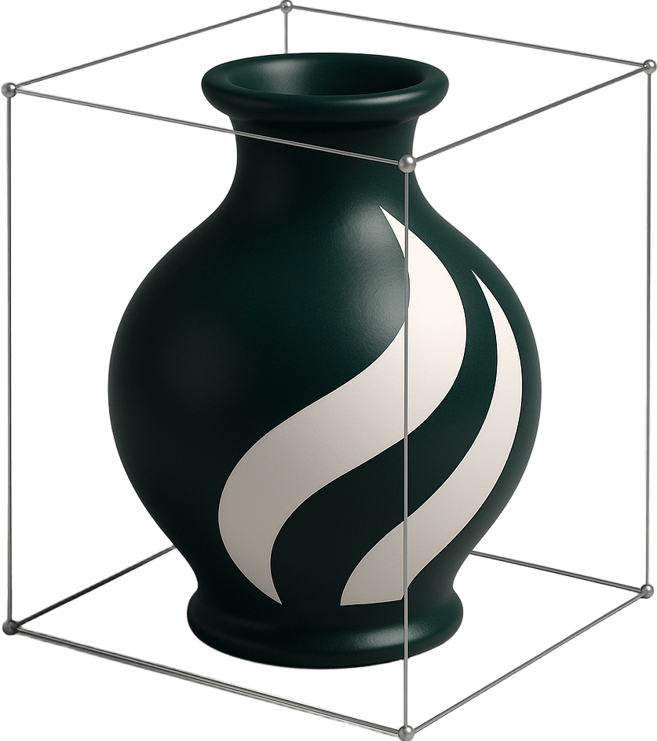

#  VaseVQA-3D: Benchmarking 3D VLMs on Ancient Greek Pottery

This is the official repository for the paper:
> **VaseVQA-3D: Benchmarking 3D VLMs on Ancient Greek Pottery**
>
> [Nonghai Zhang](https://github.com/sleepyDogseasea)\*, [Zeyu Zhang](https://steve-zeyu-zhang.github.io/)\*†, [Jiazi Wang](https://github.com/wangjiazi)\*, [Yang Zhao](https://github.com/zhaoyang), and [Hao Tang](https://ha0tang.github.io/)<sup>#</sup>
>
> \*Equal contribution. †Project lead. <sup>#</sup>Corresponding author.
>
> ### [Paper](https://arxiv.org/abs/2510.04479) | [Website](https://aigeeksgroup.github.io/VaseVQA-3D/) | [Dataset](https://huggingface.co/datasets/AIGeeksGroup/VaseVQA-3D) | [Models](https://huggingface.co/AIGeeksGroup/VaseVLM) | [HF Paper](https://huggingface.co/papers/2510.04479)

> [!NOTE]
> 💪 This visualization demonstrates VaseVQA-3D's capability in understanding and analyzing ancient Greek pottery from multiple perspectives, showcasing state-of-the-art performance in cultural heritage 3D vision-language tasks.

https://github.com/user-attachments/assets/6489a42f-1610-40a1-b2db-0bfc84029a8f

## ✏️ Citation
If you find our code or paper helpful, please consider starring ⭐ us and citing:
```bibtex
@article{zhang2025vasevqa,
  title={VaseVQA-3D: Benchmarking 3D VLMs on Ancient Greek Pottery},
  author={Zhang, Nonghai and Zhang, Zeyu and Wang, Jiazi and Zhao, Yang and Tang, Hao},
  journal={arXiv preprint arXiv:2510.04479},
  year={2025}
}
```
---

## 🏺 Introduction to VaseVQA-3D

Vision-Language Models (VLMs) have achieved significant progress in multimodal understanding tasks, demonstrating strong capabilities particularly in general tasks such as image captioning and visual reasoning. However, when dealing with specialized cultural heritage domains like 3D vase artifacts, existing models face severe data scarcity issues and insufficient domain knowledge limitations. Due to the lack of targeted training data, current VLMs struggle to effectively handle such culturally significant specialized tasks.

To address these challenges, we propose the **VaseVQA-3D dataset**, which serves as the first 3D visual question answering dataset for ancient Greek pottery analysis, collecting 664 ancient Greek vase 3D models with corresponding question-answer data and establishing a complete data construction pipeline. We further develop the **VaseVLM model**, enhancing model performance in vase artifact analysis through domain-adaptive training.

Experimental results validate the effectiveness of our approach, where we improve by **12.8% on R@1 metrics** and by **6.6% on lexical similarity** compared with previous state-of-the-art on the VaseVQA-3D dataset, significantly improving the recognition and understanding of 3D vase artifacts, providing new technical pathways for digital heritage preservation research.

### Key Features

- **High-quality 3D Models**: 664 ancient Greek vases with detailed 3D reconstructions
- **Multi-view Analysis**: Comprehensive evaluation from multiple perspectives (front, back, left, right, top, bottom)
- **Specialized Tasks**: Question answering, captioning, and visual grounding tailored for archaeological artifacts
- **VaseVLM**: A fine-tuned vision-language model specifically designed for ancient pottery analysis
- **Complete Pipeline**: End-to-end data construction and model training framework


## 📰 News

<b>2025/10/07:</b> 🎉 Our paper has been released on arXiv.

<b>2025/10/07:</b> 📌 Dataset and models are now available on HuggingFace.

<b>2025/10/07:</b> 🔔 Project website is live!

## 📋 TODO List

> [!IMPORTANT]
> We are actively developing and improving VaseVQA-3D. Stay tuned for updates!

- [x] Upload our paper to arXiv and build project pages
- [x] Release VaseVQA-3D dataset
- [x] Release VaseVLM models
- [x] Upload training and evaluation code
- [x] Release data filtering and preprocessing scripts
- [ ] Add interactive demo on HuggingFace Spaces
- [ ] Release visualization tools
- [ ] Provide pre-trained checkpoints for all model variants

## 📁 Repository Structure

```
VaseVQA-3D/
├── 3dGenerate/          # 3D model generation from 2D images
├── Train/               # Training scripts and data filtering
│   ├── filter/         # Image quality filtering (ResNet50, CLIP)
│   └── model/          # Model training (SFT, GRPO, LoRA)
├── eval/                # Evaluation scripts
│   ├── qwen.py         # Qwen2.5-VL caption generation
│   ├── internvl.py     # InternVL caption generation
│   ├── compare.py      # Caption evaluation metrics
│   └── compare.sh      # Batch evaluation
├── figs/                # Figures and visualizations
└── README.md            # This file
```

## ⚡ Quick Start

### Environment Setup

Our code is tested with CUDA 11.8 and Python 3.10. To run the codes, you should first install the required packages:

```bash
# Create conda environment
conda create -n vasevqa python=3.10
conda activate vasevqa

# Install PyTorch
pip install torch==2.0.1 torchvision==0.15.0 --index-url https://download.pytorch.org/whl/cu118

# Install other dependencies
pip install transformers>=4.35.0
pip install accelerate>=0.24.0
pip install ms-swift>=2.0.0
pip install sentence-transformers
pip install lmdeploy
pip install modelscope
pip install qwen-vl-utils
```

For detailed environment setup, please refer to:
- [Train/README.md](./Train/README.md) for training environment
- [eval/README.md](./eval/README.md) for evaluation environment

### Data Preparation

#### Download VaseVQA-3D Dataset

You can download the dataset from [HuggingFace](https://huggingface.co/datasets/AIGeeksGroup/VaseVQA-3D):

```bash
# Using huggingface-cli
huggingface-cli download AIGeeksGroup/VaseVQA-3D --repo-type dataset --local-dir ./data/VaseVQA-3D
```

The dataset includes:
- **3D Models**: GLB format with textures
- **Multi-view Images**: 6 perspectives for each vase
- **Annotations**: Captions, questions, and answers
- **Metadata**: Historical information and provenance

#### Dataset Structure

```
VaseVQA-3D/
├── models/              # 3D GLB models
├── images/              # Multi-view rendered images
│   ├── front/
│   ├── back/
│   ├── left/
│   ├── right/
│   ├── top/
│   └── bottom/
├── annotations/
│   ├── captions.json    # Image captions
│   ├── qa_pairs.json    # Question-answer pairs
│   └── metadata.json    # Historical metadata
└── README.md
```

#### Download Pre-trained Models

Download VaseVLM checkpoints from [HuggingFace](https://huggingface.co/AIGeeksGroup/VaseVLM):

```bash
# Download VaseVLM-3B
huggingface-cli download AIGeeksGroup/VaseVLM --repo-type model --local-dir ./models/VaseVLM-3B

# Download VaseVLM-7B
huggingface-cli download AIGeeksGroup/VaseVLM-7B --repo-type model --local-dir ./models/VaseVLM-7B
```

## 🔧 3D Model Generation

We provide tools to generate 3D models from 2D images using TripoSG:

```bash
cd 3dGenerate

# Activate environment
source env/bin/activate

# Generate 3D models
./triposg.sh assets/image/
```

For detailed instructions, see [3dGenerate/README.md](./3dGenerate/README.md).

## 💻 Training

### Data Filtering

Before training, filter high-quality images using our filtering pipeline:

```bash
cd Train/filter

# Step 1: ResNet50 quality classification
python classifier.py

# Step 2: CLIP-based quality filtering
./clipfilter1.sh

# Step 3: Best view selection
python clipfilter2.py --input_dir ./filtered_vases/accepted \
                      --output_dir ./filtered_vases
```

For detailed filtering instructions, see [Train/README.md](./Train/README.md).

### Model Training

#### Supervised Fine-tuning (SFT)

```bash
cd Train/model

# Train with Qwen2.5-VL-7B
./sft.sh
```

#### GRPO Reinforcement Learning

```bash
# After SFT, perform GRPO training
./grpo.sh
```

#### Merge LoRA Weights

```bash
# Merge LoRA weights into base model
./merge.sh
```

For detailed training instructions and hyperparameters, see [Train/README.md](./Train/README.md).

## 📊 Evaluation

### Caption Generation

Generate captions using VaseVLM or other models:

```bash
cd eval

# Using Qwen2.5-VL
python qwen.py --input_dir ./data/multiview_images \
               --output_dir ./data/captions \
               --model_path ./models/VaseVLM-7B

# Using InternVL
python internvl.py --input_dir ./data/multiview_images \
                   --output_dir ./data/captions \
                   --model_path ./models/InternVL3_5-4B
```

### Evaluation Metrics

Evaluate generated captions against ground truth:

```bash
# Single model evaluation
python compare.py --generated ./data/captions/image_vasevlm.json \
                  --ground_truth ./data/groundTruth.json

# Batch evaluation
./compare.sh
```

Evaluation metrics include:
- **CLIP Score**: Semantic similarity in CLIP embedding space
- **FID Score**: Distribution similarity
- **R-Precision**: Retrieval accuracy (R@1, R@5, R@10)
- **Lexical Similarity**: Word overlap (Jaccard)
- **Overall Score**: Weighted combination of all metrics

For detailed evaluation instructions, see [eval/README.md](./eval/README.md).

## 📈 Benchmark Results

### Caption Generation Performance

We evaluate various models on the VaseVQA-3D benchmark. Lower FID scores and higher values for other metrics indicate better performance.

#### 3D-Specialized Models

| Method | FID↓ | CLIP↑ | R@10↑ | R@5↑ | R@1↑ | Lexical Sim.↑ |
|--------|------|-------|-------|------|------|---------------|
| DiffuRank | 0.421 | **0.798** | 16.67% | 8.33% | 2.08% | 0.274 |
| Cap3D | 0.445 | 0.792 | 14.58% | 7.29% | 1.56% | 0.267 |
| LLaVA3D | 0.494 | 0.784 | 10.42% | 5.21% | 1.04% | 0.238 |

#### Closed-source VLMs

| Method | FID↓ | CLIP↑ | R@10↑ | R@5↑ | R@1↑ | Lexical Sim.↑ |
|--------|------|-------|-------|------|------|---------------|
| Gemini-2.5-flash | **0.325** | 0.736 | **28.57%** | **17.58%** | 2.20% | 0.210 |
| Claude-4-sonnet | 0.353 | 0.676 | 23.96% | 10.42% | 3.12% | 0.188 |
| Gemini-2.5-Pro | 0.397 | 0.680 | 22.92% | 14.58% | 3.12% | 0.162 |
| GPT-4.1 | 0.501 | 0.644 | 25.00% | 10.42% | 3.12% | 0.128 |
| Claude-3.5-sonnet | 0.455 | 0.643 | 15.62% | 8.33% | 2.08% | 0.116 |
| Doubao-1.5-vision-pro-32k | 0.504 | 0.606 | 14.58% | 4.17% | 1.04% | 0.074 |
| GPT-4o | 0.582 | 0.520 | 13.54% | 6.25% | 2.08% | 0.104 |
| Claude-3.7-sonnet | 0.600 | 0.339 | 13.54% | 6.25% | 1.04% | 0.101 |

#### Open-source VLMs

| Method | FID↓ | CLIP↑ | R@10↑ | R@5↑ | R@1↑ | Lexical Sim.↑ |
|--------|------|-------|-------|------|------|---------------|
| InternVL | 0.376 | 0.771 | 10.42% | 8.33% | 2.08% | 0.252 |
| Qwen2.5-VL-7B | 0.334 | 0.775 | 18.75% | 9.38% | 2.08% | 0.217 |
| Qwen2.5-VL-3B | 0.358 | 0.782 | 9.38% | 6.25% | 1.04% | 0.259 |
| VaseVL | 0.493 | 0.790 | 10.4% | 6.25% | 2.08% | 0.255 |

#### Our Models

| Method | FID↓ | CLIP↑ | R@10↑ | R@5↑ | R@1↑ | Lexical Sim.↑ |
|--------|------|-------|-------|------|------|---------------|
| **VaseVLM-3B-SFT** | 0.359 | 0.788 | 17.71% | 8.33% | 2.08% | 0.223 |
| **VaseVLM-3B-RL** | 0.363 | 0.789 | 17.71% | 10.42% | 2.08% | 0.245 |
| **VaseVLM-7B-SFT** | 0.332 | 0.779 | 20.83% | 10.42% | 3.12% | 0.272 |
| **VaseVLM-7B-RL** | 0.328 | 0.792 | 21.24% | 11.12% | **3.52%** | **0.276** |

> **Note**: Our VaseVLM-7B-RL model achieves the best performance among open-source models on R@1 and Lexical Similarity metrics, demonstrating the effectiveness of reinforcement learning fine-tuning for cultural heritage understanding.

## 🎯 Use Cases

VaseVQA-3D and VaseVLM can be applied to various cultural heritage tasks:

### 1. Archaeological Documentation
- Automated cataloging of pottery collections
- Generating detailed descriptions for museum databases
- Cross-referencing similar artifacts

### 2. Educational Applications
- Interactive learning tools for art history students
- Virtual museum guides
- Automated quiz generation

### 3. Research Support
- Pattern recognition across pottery styles
- Dating and provenance analysis
- Iconographic studies

### 4. Conservation
- Damage assessment and documentation
- Restoration planning
- Condition monitoring over time

## 🌟 Star History

[](https://www.star-history.com/#AIGeeksGroup/VaseVQA-3D&Date)

## 🤝 Contributing

We welcome contributions to VaseVQA-3D! Please feel free to:
- Report bugs and issues
- Submit pull requests
- Suggest new features
- Share your results and applications

## 📄 License

This project is released under the MIT License. See [LICENSE](./LICENSE) for details.

## 😘 Acknowledgement

We thank the authors of the following projects for their open-source contributions:
- [Qwen](https://github.com/QwenLM/Qwen) for the base vision-language model
- [MS-SWIFT](https://github.com/modelscope/swift) for the training framework
- [InternVL](https://github.com/OpenGVLab/InternVL) for multi-modal understanding
- [CLIP](https://github.com/openai/CLIP) for vision-language alignment
- [TripoSG](https://github.com/VAST-AI-Research/TripoSR) for 3D generation
- The museums and institutions that provided the pottery images

Special thanks to the archaeological and art history communities for their valuable feedback and domain expertise.

## 📧 Contact

For questions and discussions, please:
- Open an issue on GitHub
- Contact the authors via email
- Visit our [project website](https://aigeeksgroup.github.io/VaseVQA-3D/)

